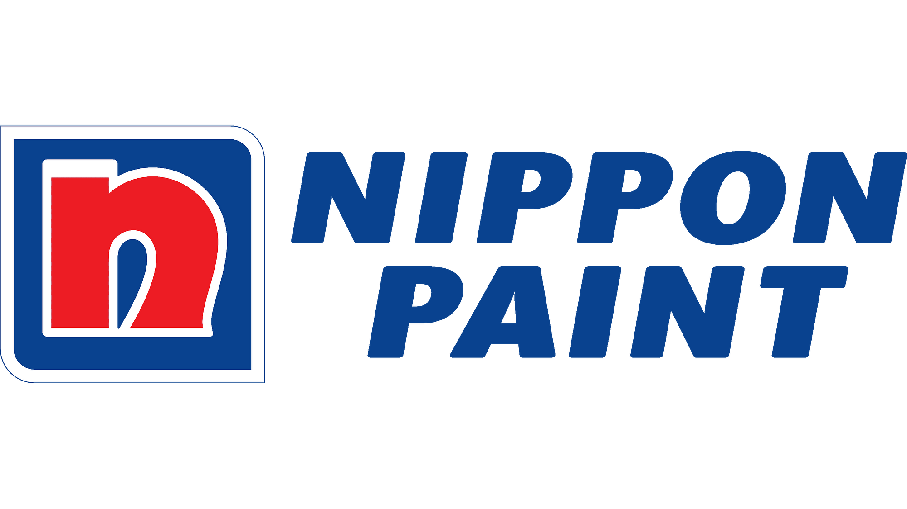
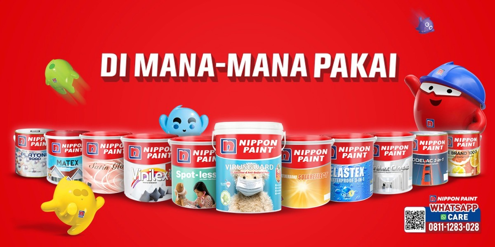
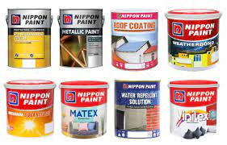
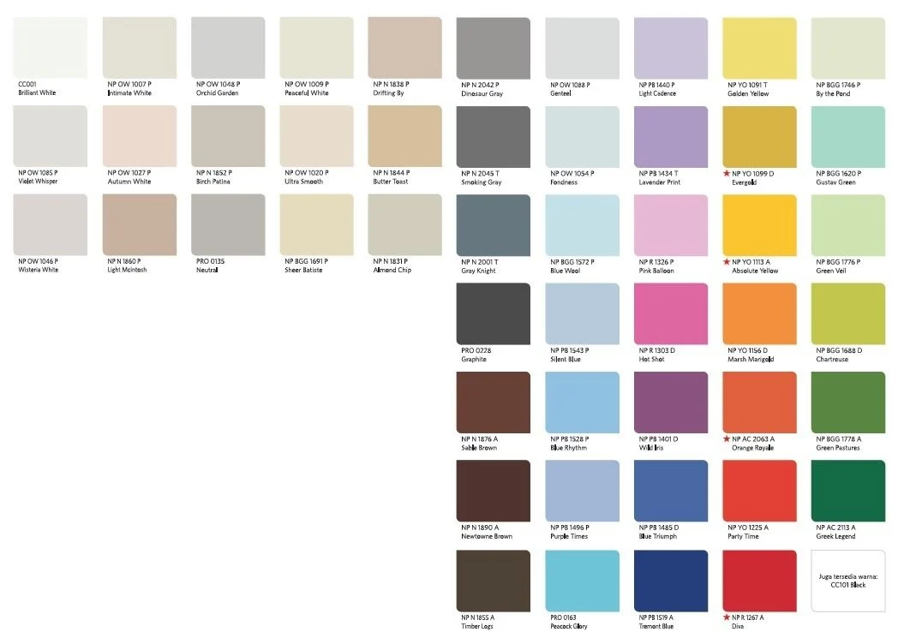
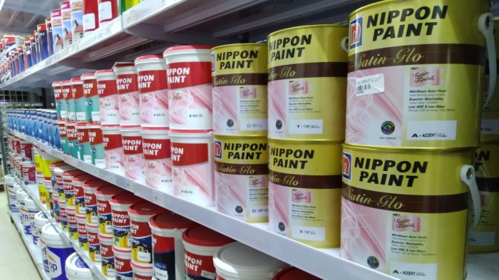
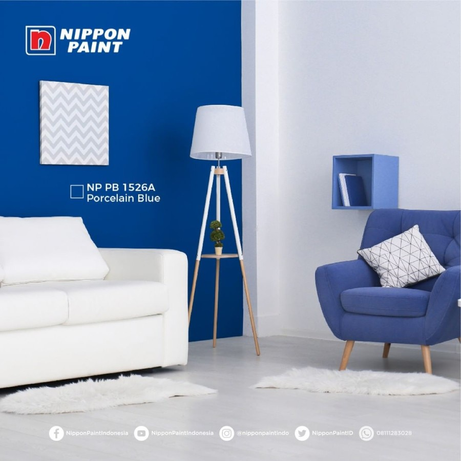

<!DOCTYPE html>
<html lang="en">

<head>
    <meta charset="UTF-8">
    <meta http-equiv="X-UA-Compatible" content="IE=edge">
    <meta name="viewport" content="width=device-width, initial-scale=1.0">
    <title>UTS SIM</title>
    <link rel="preconnect" href="https://fonts.gstatic.com">
    <link href="https://fonts.googleapis.com/css2?family=Inter&display=swap" rel="stylesheet">

    <link rel="stylesheet" href="style.css">
</head>

<body>
    <nav class="navbar">
        <h1>UTS SIM Ipan</h1>
        

            
Home

            
Articles

            
            
            
        

    </nav>
    <section class="hero-container">
        

            

                <h1>Grosir Cat terbaik Di indonesia
                </h1>
                
why learn how to blog?

            

        

        
    </section>
    <section class="description-container">
        

            

                <h2>Apa kelebihan Nippon Paint?</h2>
                
Memiliki keunggulan cepat kering, anti-jamur, anti-pudar, warna awet, tahan lama, dapat dicuci, dan tahan sikat hingga 2.000 kali. Mempunyai daya tutup yang baik serta hasil yang halus dan merata. Dapat digunakan untuk tembok dan langit-langit berbahan dasar beton, plaster, papan, asbes, mortar, batako, dan lain-lain.            

            

                
Nov 11th 2022

                
Read more

            

        

        
    </section>
    <section class="content-container">
        

            
            

                <h3>Produk Nippon Paint apa saja??</h3>
                
Dinding Eksterior  
                    1.NIPPON PU RECOATABLE FINISH (GLOSS / SOFT MATT)  
                    2.NIPPON METALLIC PAINT.  
                    3.ROOF COATING SB.  
                    4.WATER REPELLENT SOLUTION.  
                    5.METALLIC PAINT (WATER-BASED)  
                    6.HYDRO-FAST.  
                    7.Nippon Vinilex (With Silver-Ion)  
                    8.VINILEX GLOSS.              

            

                
Nov 11th 2022

                
Read more

            

        

        

            
            

                <h3>Berapa warna Tinting Nippon Paint?</h3>
                
Dinding Eksterior 

                    Kini telah tersedia dengan lebih dari 2000 warna pilihan  
                    Putih.  
                    beberapa variasi warna Nippon Paint Elastex 
1.Black 10. 
2.Sashay Red. 
3.Spring Vigor. 
4.Golden Dome. 
5.Disco Beat. 
6.Grey 05. 
7.Pink Crown 1283 T.           

            

                
Nov 11th 2022

                
Read more

            

        

        

            
            

                <h3>Apa kelebihan Cat Nippon Paint?</h3> 
                
Memiliki keunggulan cepat kering, anti-jamur, anti-pudar, warna awet, tahan lama, dapat dicuci, dan tahan sikat hingga 2.000 kali. Mempunyai daya tutup yang baik serta hasil yang halus dan merata. Dapat digunakan untuk tembok dan langit-langit berbahan dasar beton, plaster, papan, asbes, mortar, batako, dan lain-lain.
                

            

                
Nov 11th 2022

                
Read more

            

        

    </section>
    <section class="what-is-container">
        

            

                <h1>VINILEX (WITH SILVER-ION)</h1>
                
VINILEX (WITH SILVER-ION) merupakan cat tembok berkualitas tinggi yang diformulasikan khusus dengan teknologi Silver-Ion yang dapat membantu melindungi secara efektif dari berbagai jenis kuman seperti MRSA, E-Coli dan Staphylococcus Aureus untuk mencegah asma, flu, dan diare. Keunggulan lainnya yaitu cepat kering dan minimal cipratan. Tersedia lebih dari 2.000 pilihan warna menarik untuk dinding interior, exterior, dan langit-langit berbahan dasar asbes, batako, beton, papan, dan mortar.

                    Silver-Ion adalah salah satu anti-mikrobial alami yang tertua di dunia dan mampu membasmi perkembangan mikro-organisme seperti kuman. Teknologi Silver-Ion ini sangat aman bagi manusia maupun binatang peliharaan. VINILEX (WITH SILVER-ION) TERSEDIA LEBIH DARI 2.000 PILIHAN WARNA MENARIK. 
                    
                    KEUNGGULAN 
                    1. Melindungi Keluarga Secara Efektif dari Berbagai Jenis Kuman dengan Teknologi Silver-Ion 
                    2. Dapat Dicuci dan Tahan Disikat 1.200 kali 
                    3. Tahan Sinar Matahari dan Warna Lebih Awet 
                    4. Cocok Digunakan untuk Dinding Interior 
                    
                    *KETERANGAN : 
                    CHAT UNTUK MENGONFIRMASI WARNA DAN STOK YA KK
                                    

            

            

                
Nov 11th 2022

                
Read more

            

        

        
    </section>
    <section class="button-container">
        <button class="btn">See More Now</button>
    </section>
    <footer>
        
<b>Grosir cat murah terpercaya</b> 2022 copyright all rights reserved

        

            
            
            
        

    </footer>

</body>

</html>
